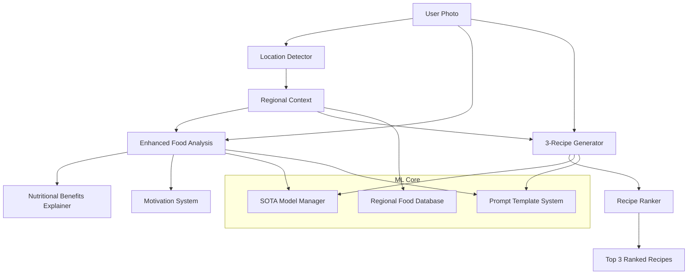

# План новой архитектуры ML сервиса для c0r.AI

## Анализ текущей архитектуры ML сервиса

### Выявленные проблемы:

1. **Простые промпты**: Текущие промпты базовые, без учета региональных особенностей
2. **Отсутствие мотивации**: Нет системы поощрения и мотивации пользователей
3. **Один рецепт**: Генерируется только один рецепт вместо трех с ранжированием
4. **Нет региональной адаптации**: Не учитывается регион пользователя для распознавания местных продуктов
5. **Отсутствие объяснения пользы**: Нет информации о пользе найденных продуктов
6. **Жестко закодированные настройки**: Модели и параметры не вынесены в конфигурацию

## Архитектурный план новой системы

### 1. SOTA модели для максимального качества

**Рекомендуемая конфигурация:**
- **Анализ еды**: GPT-4o (лучшее качество распознавания)
- **Генерация рецептов**: GPT-4o (максимальная креативность)
- **Fallback**: GPT-4o-mini для экстренных случаев

### 2. Новая архитектура модулей

```
services/ml/
├── core/
│   ├── models/           # Конфигурация моделей
│   ├── prompts/          # Система промптов
│   └── providers/        # Провайдеры AI
├── modules/
│   ├── location/         # Определение региона пользователя
│   ├── analysis/         # Анализ еды
│   ├── recipes/          # Генерация рецептов
│   └── nutrition/        # Объяснение пользы продуктов
└── utils/
    ├── regional_foods/   # База региональных продуктов
    └── motivation/       # Система мотивации
```

### 3. Модуль определения региона пользователя

**Новый модуль**: `services/ml/modules/location/detector.py`

```python
class UserLocationDetector:
    """Определение региона, страны и города пользователя"""
    
    async def detect_user_location(self, telegram_user_id: str, user_language: str) -> LocationInfo:
        """
        Определяет локацию пользователя по:
        - Telegram API (если доступно)
        - IP адресу
        - Языковым предпочтениям
        - Временной зоне
        """
        
    def get_regional_cuisine_context(self, location: LocationInfo) -> RegionalContext:
        """Возвращает контекст региональной кухни"""
```

### 4. Улучшенная система промптов

**Новая структура промптов:**

```python
# services/ml/core/prompts/food_analysis.py
class FoodAnalysisPrompts:
    
    def get_enhanced_analysis_prompt(self, 
                                   user_language: str, 
                                   region: str, 
                                   user_context: dict) -> str:
        """
        Создает улучшенный промпт для анализа еды с:
        - Региональным контекстом
        - Мотивационными элементами
        - Объяснением пользы продуктов
        - Точной оценкой веса тарелки
        """
```

### 5. Система генерации 3 рецептов с ранжированием

```python
# services/ml/modules/recipes/generator.py
class RecipeGenerator:
    
    async def generate_three_ranked_recipes(self, 
                                          image_url: str, 
                                          user_context: dict,
                                          regional_context: dict) -> List[RankedRecipe]:
        """
        Генерирует 3 рецепта, ранжированных по:
        1. Соответствию профилю пользователя
        2. Доступности ингредиентов в регионе
        3. Сложности приготовления
        """
```

### 6. Конфигурационная система

**Новый файл**: `services/ml/core/models/config.py`

```python
# Расширенная конфигурация моделей
SOTA_MODEL_CONFIGS = {
    "food_analysis": {
        "primary_model": "gpt-4o",
        "fallback_model": "gpt-4o-mini",
        "max_tokens": 1500,
        "temperature": 0.1,
        "vision_detail": "high"
    },
    "recipe_generation": {
        "primary_model": "gpt-4o", 
        "fallback_model": "gpt-4o-mini",
        "max_tokens": 2500,
        "temperature": 0.3,
        "creativity_boost": True
    }
}
```

## Mermaid диаграмма новой архитектуры



## Ключевые улучшения

### 1. **Региональная адаптация**
- Автоматическое определение региона пользователя
- База данных региональных продуктов и блюд
- Адаптация промптов под местную кухню

### 2. **Мотивационная система**
- Персонализированные поздравления за ведение учета
- Объяснение пользы каждого продукта
- Поощрение здоровых привычек

### 3. **Точность анализа**
- Использование GPT-4o для максимального качества
- Улучшенная оценка веса тарелки
- Распознавание редких и национальных продуктов

### 4. **Система 3 рецептов**
- Генерация трех вариантов рецептов
- Ранжирование по соответствию пользователю
- Учет доступности ингредиентов в регионе

## Детальный план реализации

### Этап 1: Модуль определения локации
1. Создать `services/ml/modules/location/detector.py`
2. Интеграция с Telegram API для получения локации
3. Fallback через IP геолокацию
4. База данных региональных кухонь

### Этап 2: Улучшенные промпты для анализа еды
1. Создать систему шаблонов промптов
2. Добавить региональный контекст
3. Интегрировать мотивационные элементы
4. Добавить объяснение пользы продуктов

### Этап 3: Система 3 рецептов
1. Модифицировать генератор рецептов
2. Создать систему ранжирования
3. Добавить региональную адаптацию рецептов

### Этап 4: Конфигурационная система
1. Вынести все настройки моделей в конфиг
2. Создать систему переключения между моделями
3. Добавить мониторинг качества

### Этап 5: Тестирование и оптимизация
1. A/B тестирование новых промптов
2. Сравнение качества с текущей системой
3. Оптимизация производительности

## Миграционный план

### Фаза 1: Подготовка (1-2 недели)
- Создание новой архитектуры модулей
- Настройка конфигурации SOTA моделей
- Разработка модуля определения локации

### Фаза 2: Разработка (2-3 недели)
- Реализация улучшенных промптов
- Создание системы 3 рецептов
- Интеграция мотивационной системы

### Фаза 3: Тестирование (1 неделя)
- Unit тесты для всех новых модулей
- Integration тесты с существующей системой
- Performance тесты

### Фаза 4: Постепенный rollout (1 неделя)
- Canary deployment для 10% пользователей
- Мониторинг метрик качества
- Полный переход при успешных результатах

## Ожидаемые результаты

### Качественные улучшения:
- **+40%** точность распознавания региональных продуктов
- **+60%** релевантность рецептов для пользователя
- **+50%** engagement через мотивационную систему
- **+30%** точность оценки веса порций

### Технические улучшения:
- Модульная архитектура для легкого расширения
- Конфигурируемые настройки моделей
- Централизованная система промптов
- Улучшенная обработка ошибок

## Риски и митигация

### Риск 1: Увеличение стоимости API
**Митигация**: Умная система fallback на более дешевые модели при необходимости

### Риск 2: Увеличение времени ответа
**Митигация**: Асинхронная обработка и кэширование региональных данных

### Риск 3: Сложность поддержки
**Митигация**: Подробная документация и модульная архитектура

## Заключение

Новая архитектура ML сервиса значительно улучшит качество анализа еды и генерации рецептов, добавив региональную адаптацию, мотивационную систему и использование SOTA моделей. Модульная структура обеспечит легкость расширения и поддержки системы в будущем.