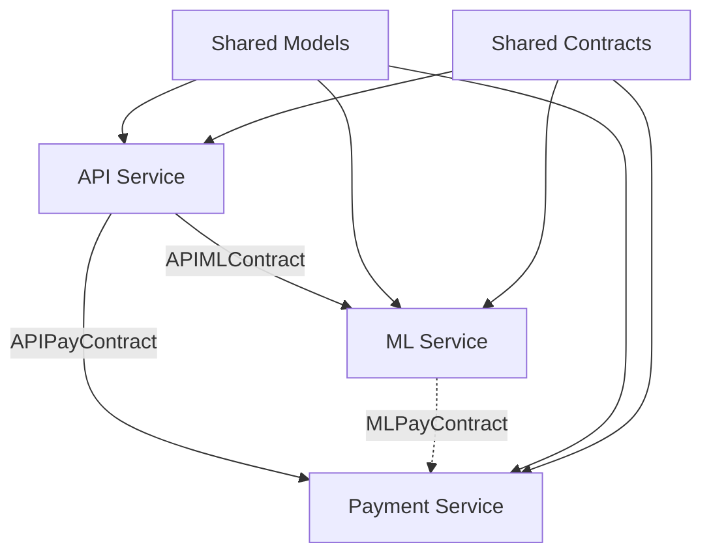

# API Contracts Documentation

Документация по API контрактам между сервисами c0r.AI.

## 📋 Обзор

API контракты обеспечивают типизированное и валидированное взаимодействие между сервисами через Pydantic модели.

### 🏗️ Архитектура



## 🔧 Shared Models

### Общие модели (`shared/models/`)

#### Common Models
```python
from shared.models.common import BaseResponse, ErrorResponse, HealthResponse

# Базовый ответ
response = BaseResponse(
    success=True,
    message="Operation completed"
)

# Ответ с ошибкой
error = ErrorResponse(
    success=False,
    message="Validation failed",
    error_code="VALIDATION_001",
    details={"field": "user_id", "error": "required"}
)
```

#### User Models
```python
from shared.models.user import UserProfile, UserRequest, UserCreditsRequest

# Профиль пользователя
profile = UserProfile(
    telegram_id=123456789,
    credits_remaining=50,
    country="RU",
    language="ru",
    age=25,
    dietary_preferences=["vegetarian"],
    allergies=["nuts"]
)

# Запрос на добавление кредитов
credits_request = UserCreditsRequest(
    user_id="123456789",
    count=20,
    payment_id="pay_123",
    amount=100.0,
    gateway="yookassa"
)
```

#### Nutrition Models
```python
from shared.models.nutrition import NutritionData, FoodItem, AnalysisRequest

# Данные о питании
nutrition = NutritionData(
    calories=250.0,
    proteins=15.0,
    fats=8.0,
    carbohydrates=30.0,
    fiber=5.0
)

# Продукт питания
food_item = FoodItem(
    name="Куриная грудка",
    weight="150г",
    calories=165.0,
    nutrition=nutrition
)

# Запрос на анализ
analysis_request = AnalysisRequest(
    user_id="123456789",
    image_url="https://example.com/food.jpg",
    provider="openai",
    user_language="ru"
)
```

#### Payment Models
```python
from shared.models.payment import InvoiceRequest, PaymentRequest

# Запрос на создание счета
invoice_request = InvoiceRequest(
    user_id="123456789",
    amount=100.0,
    description="Покупка кредитов",
    plan_id="basic",
    currency="RUB"
)

# Запрос на обработку платежа
payment_request = PaymentRequest(
    user_id="123456789",
    payment_id="pay_123",
    amount=100.0,
    gateway="yookassa",
    status="succeeded"
)
```

#### ML Models
```python
from shared.models.ml import MLAnalysisRequest, RecipeRequest, RecipeGenerationContext

# Запрос на ML анализ
ml_request = MLAnalysisRequest(
    user_id="123456789",
    image_url="https://example.com/food.jpg",
    provider="openai",
    user_language="ru"
)

# Контекст для генерации рецепта
context = RecipeGenerationContext(
    language="ru",
    has_profile=True,
    dietary_preferences=["vegetarian"],
    allergies=["nuts"],
    goal="lose_weight"
)

# Запрос на генерацию рецепта
recipe_request = RecipeRequest(
    telegram_user_id="123456789",
    image_url="https://example.com/ingredients.jpg",
    user_context=context
)
```

## 📡 Service Contracts

### API ↔ ML Service Contract

```python
from shared.contracts.api_ml import APIMLContract

# Создание запроса на анализ еды
request = APIMLContract.analyze_food_request(
    user_id="123456789",
    image_url="https://example.com/food.jpg",
    provider="openai",
    user_language="ru"
)

# Парсинг ответа от ML сервиса
response_data = {
    "success": True,
    "kbzhu": {
        "calories": 250.0,
        "proteins": 15.0,
        "fats": 8.0,
        "carbohydrates": 30.0
    },
    "analysis_provider": "openai"
}

response = APIMLContract.analyze_food_response(response_data)

# Получение заголовков для запроса
headers = APIMLContract.get_required_headers()

# Обработка ошибок
error_response = APIMLContract.handle_ml_error(500, {"detail": "OpenAI API error"})
```

### API ↔ Payment Service Contract

```python
from shared.contracts.api_pay import APIPayContract

# Создание запроса на счет
invoice_request = APIPayContract.create_invoice_request(
    user_id="123456789",
    amount=100.0,
    description="Покупка кредитов",
    plan_id="premium"
)

# Создание запроса на добавление кредитов
credits_request = APIPayContract.add_credits_request(
    user_id="123456789",
    count=50,
    payment_id="pay_123",
    amount=200.0
)

# Получение доступных планов
plans = APIPayContract.get_available_plans()

# Валидационные правила
rules = APIPayContract.VALIDATION_RULES
max_amount = rules["max_amount"]  # 100000.0
supported_currencies = rules["supported_currencies"]  # ["RUB", "USD", "EUR"]
```

### ML ↔ Payment Service Contract (Future)

```python
from shared.contracts.ml_pay import MLPayContract

# Отслеживание использования премиум модели
usage_request = MLPayContract.track_premium_usage_request(
    user_id="123456789",
    model_used="gpt-4o",
    tokens_consumed=1500,
    processing_time=2.5,
    cost_estimate=0.075
)

# Расчет стоимости модели
cost = MLPayContract.calculate_model_cost("gpt-4o-mini", 1000, 500)
print(f"Cost: ${cost}")  # Cost: $0.00045

# Проверка конфигурации
config = MLPayContract.CONFIG
if config["usage_tracking_enabled"]:
    # Отслеживание включено
    pass
```

## 🔄 Использование в Сервисах

### В API Service

```python
from shared.contracts.api_ml import APIMLContract
from shared.contracts.api_pay import APIPayContract
import httpx

# Запрос к ML сервису
async def analyze_food(user_id: str, image_url: str):
    request = APIMLContract.analyze_food_request(
        user_id=user_id,
        image_url=image_url,
        provider="openai",
        user_language="ru"
    )
    
    async with httpx.AsyncClient() as client:
        response = await client.post(
            f"{ML_SERVICE_URL}/api/v1/analyze",
            headers=APIMLContract.get_required_headers(),
            json=request.dict()
        )
        
        if response.status_code == 200:
            return APIMLContract.analyze_food_response(response.json())
        else:
            return APIMLContract.handle_ml_error(response.status_code, response.json())

# Запрос к Payment сервису
async def create_invoice(user_id: str, amount: float):
    request = APIPayContract.create_invoice_request(
        user_id=user_id,
        amount=amount,
        description="Покупка кредитов"
    )
    
    async with httpx.AsyncClient() as client:
        response = await client.post(
            f"{PAY_SERVICE_URL}/invoice",
            headers=APIPayContract.get_required_headers(),
            json=request.dict()
        )
        
        return APIPayContract.create_invoice_response(response.json())
```

### В ML Service

```python
from shared.models.ml import MLAnalysisRequest, MLAnalysisResponse
from shared.models.nutrition import NutritionData

@app.post("/api/v1/analyze")
async def analyze_food(request: MLAnalysisRequest):
    # Валидация входящего запроса автоматически выполняется Pydantic
    
    # Выполнение анализа
    nutrition_data = await perform_analysis(request.image_url, request.user_language)
    
    # Создание типизированного ответа
    response = MLAnalysisResponse(
        success=True,
        kbzhu=NutritionData(**nutrition_data),
        analysis_provider=request.provider,
        confidence_score=0.95
    )
    
    return response
```

### В Payment Service

```python
from shared.models.payment import InvoiceRequest, InvoiceResponse

@app.post("/invoice")
async def create_invoice(request: InvoiceRequest):
    # Валидация входящего запроса
    
    # Создание счета в платежной системе
    invoice_data = await create_yookassa_invoice(
        user_id=request.user_id,
        amount=request.amount,
        description=request.description
    )
    
    # Типизированный ответ
    response = InvoiceResponse(
        success=True,
        invoice_id=invoice_data["id"],
        payment_url=invoice_data["confirmation"]["confirmation_url"],
        amount=request.amount,
        currency=request.currency
    )
    
    return response
```

## ✅ Валидация и Типизация

### Автоматическая валидация

```python
from shared.models.user import UserProfile
from pydantic import ValidationError

try:
    # Валидация пройдет успешно
    profile = UserProfile(
        telegram_id=123456789,
        credits_remaining=50,
        country="RU"
    )
except ValidationError as e:
    print(f"Validation error: {e}")

try:
    # Валидация не пройдет - неверный telegram_id
    profile = UserProfile(
        telegram_id=-1,  # Должен быть положительным
        credits_remaining=50
    )
except ValidationError as e:
    print(f"Validation error: {e}")
    # ValidationError: Telegram ID must be positive
```

### Кастомные валидаторы

```python
from shared.models.ml import MLAnalysisRequest
from pydantic import ValidationError

try:
    # Валидация не пройдет - неверный URL
    request = MLAnalysisRequest(
        user_id="123456789",
        image_url="invalid-url",  # Должен быть HTTP/HTTPS
        provider="openai"
    )
except ValidationError as e:
    print(f"Validation error: {e}")
    # ValidationError: Image URL must be a valid HTTP/HTTPS URL
```

## 🧪 Тестирование

### Unit тесты

```bash
# Тестирование моделей
python -m pytest tests/unit/test_shared_models.py -v

# Тестирование контрактов
python -m pytest tests/integration/test_shared_contracts.py -v
```

### Примеры тестов

```python
def test_user_profile_validation():
    """Test UserProfile validation"""
    # Валидный профиль
    profile = UserProfile(
        telegram_id=123456789,
        credits_remaining=50,
        country="US"
    )
    assert profile.telegram_id == 123456789
    
    # Невалидный профиль
    with pytest.raises(ValueError):
        UserProfile(telegram_id=-1)

def test_api_ml_contract_flow():
    """Test API to ML service contract flow"""
    # Создание запроса
    request = APIMLContract.analyze_food_request(
        user_id="123456789",
        image_url="https://example.com/food.jpg"
    )
    
    # Парсинг ответа
    response_data = {"success": True, "kbzhu": {...}}
    response = APIMLContract.analyze_food_response(response_data)
    
    assert request.user_id == "123456789"
    assert response.success is True
```

## 📚 Лучшие практики

### 1. Использование контрактов

```python
# ✅ Правильно - используйте контракты
from shared.contracts.api_ml import APIMLContract

request = APIMLContract.analyze_food_request(...)
headers = APIMLContract.get_required_headers()

# ❌ Неправильно - ручное создание запросов
request_data = {
    "user_id": user_id,
    "image_url": image_url,
    # Возможны ошибки в структуре
}
```

### 2. Обработка ошибок

```python
# ✅ Правильно - используйте стандартизированную обработку ошибок
try:
    response = await call_ml_service(request)
except httpx.HTTPStatusError as e:
    error_response = APIMLContract.handle_ml_error(
        e.response.status_code,
        e.response.json()
    )
    return error_response
```

### 3. Валидация данных

```python
# ✅ Правильно - полагайтесь на Pydantic валидацию
@app.post("/analyze")
async def analyze(request: MLAnalysisRequest):
    # request уже валидирован
    return await process_analysis(request)

# ❌ Неправильно - ручная валидация
@app.post("/analyze")
async def analyze(request: dict):
    if "user_id" not in request:
        raise HTTPException(400, "user_id required")
    # Много ручной валидации...
```

## 🔄 Миграция и Обновления

### Обратная совместимость

При обновлении моделей соблюдайте обратную совместимость:

```python
# ✅ Правильно - добавление опциональных полей
class UserProfile(BaseModel):
    telegram_id: int
    credits_remaining: int
    # Новое опциональное поле
    premium_until: Optional[datetime] = None

# ❌ Неправильно - изменение обязательных полей
class UserProfile(BaseModel):
    telegram_id: int
    credits_remaining: int
    # Это сломает существующий код
    required_new_field: str
```

### Версионирование

```python
# Используйте версионирование для breaking changes
from shared.models.user_v2 import UserProfile as UserProfileV2
```

## 📖 Дополнительные ресурсы

- [Pydantic Documentation](https://docs.pydantic.dev/)
- [FastAPI with Pydantic](https://fastapi.tiangolo.com/tutorial/body/)
- [API Design Best Practices](https://docs.microsoft.com/en-us/azure/architecture/best-practices/api-design)

---

**Примечание:** Все контракты автоматически обеспечивают типизацию, валидацию и документацию API через Pydantic модели.