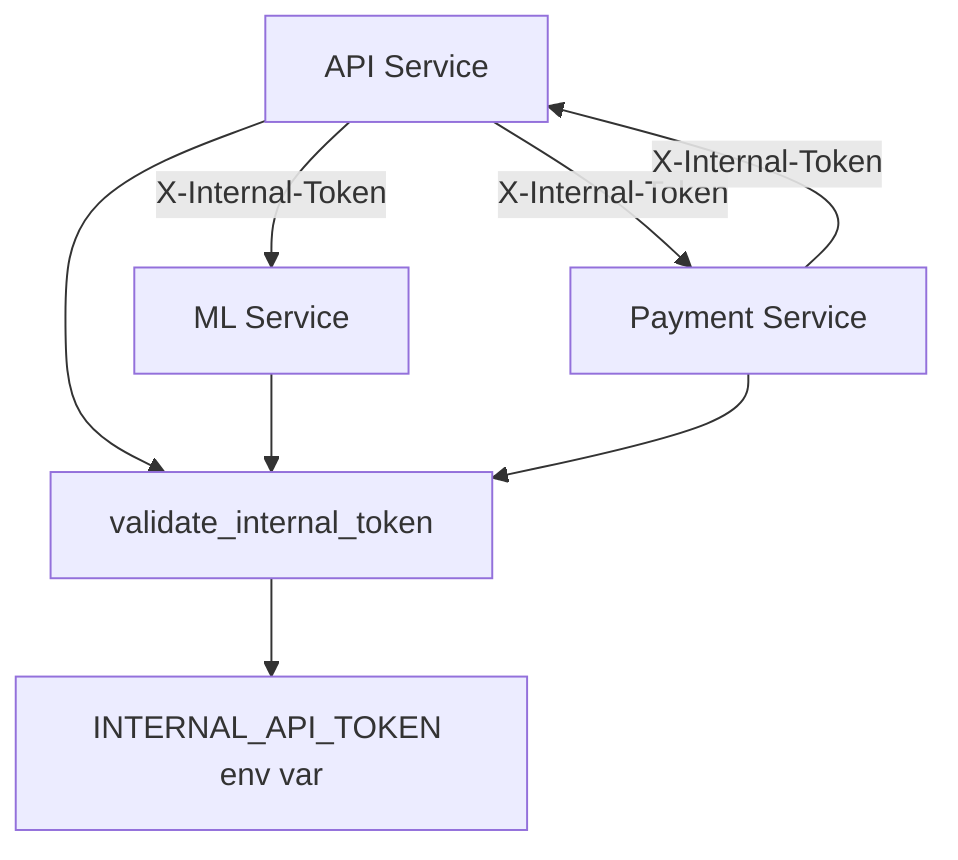

# Service Authentication

Система аутентификации для межсервисного взаимодействия в c0r.AI.

## 🔐 Обзор

Все сервисы (API, ML, Payment) используют единую систему аутентификации на основе внутреннего API токена для безопасного взаимодействия друг с другом.

## 🛠️ Компоненты

### Shared Authentication Module

Расположение: [`shared/auth/`](../../shared/auth/)

**Основные функции:**
- `validate_internal_token(token)` - валидация токена
- `require_internal_auth` - декоратор для защиты эндпоинтов
- `get_auth_headers()` - получение заголовков для исходящих запросов
- `check_service_auth()` - проверка конфигурации аутентификации

### Environment Configuration

```bash
# .env
INTERNAL_API_TOKEN=your-secure-token-here-minimum-32-characters
```

**Требования к токену:**
- Минимум 32 символа
- Уникальный для каждой среды (dev/staging/prod)
- Должен быть секретным и не попадать в логи

## 🔒 Защищенные Эндпоинты

### API Service
- `POST /credits/add` - добавление кредитов пользователю

### ML Service  
- `POST /analyze` - анализ изображения
- `POST /recipe` - генерация рецепта

### Payment Service
- `POST /invoice` - создание инвойса

## 📡 Межсервисное Взаимодействие

### Исходящие Запросы

```python
from shared.auth import get_auth_headers
import httpx

async def call_ml_service(user_id: str, image_url: str):
    async with httpx.AsyncClient() as client:
        response = await client.post(
            f"{ML_SERVICE_URL}/analyze",
            headers=get_auth_headers(),  # Автоматически добавляет X-Internal-Token
            json={"user_id": user_id, "image_url": image_url}
        )
        return response.json()
```

### Входящие Запросы

```python
from shared.auth import require_internal_auth
from fastapi import FastAPI, Request

app = FastAPI()

@app.post("/protected-endpoint")
@require_internal_auth  # Автоматически валидирует X-Internal-Token
async def protected_endpoint(request: Request):
    # Этот эндпоинт доступен только с валидным токеном
    return {"status": "authenticated"}
```

## 🔄 Схема Взаимодействия



## ⚡ Быстрый Старт

### 1. Настройка Токена

```bash
# Генерация безопасного токена
openssl rand -hex 32

# Добавление в .env
echo "INTERNAL_API_TOKEN=$(openssl rand -hex 32)" >> .env
```

### 2. Защита Эндпоинта

```python
from shared.auth import require_internal_auth

@app.post("/my-endpoint")
@require_internal_auth
async def my_endpoint(request: Request):
    return {"message": "Protected endpoint"}
```

### 3. Вызов Другого Сервиса

```python
from shared.auth import get_auth_headers

headers = get_auth_headers()
response = await client.post(url, headers=headers, json=data)
```

## 🧪 Тестирование

### Unit Tests

```bash
# Тестирование аутентификации
python -m pytest tests/unit/test_service_auth.py -v
```

### Integration Tests

```bash
# Тестирование межсервисного взаимодействия
python -m pytest tests/integration/test_service_auth_integration.py -v
```

### Тестовые Сценарии

1. **Валидный токен** - запрос проходит
2. **Невалидный токен** - HTTP 401
3. **Отсутствующий токен** - HTTP 401
4. **Неконфигурированный токен** - ValueError

## 🚨 Безопасность

### Best Practices

1. **Ротация токенов** - меняйте токены регулярно
2. **Разные токены для сред** - dev/staging/prod должны иметь разные токены
3. **Логирование** - не логируйте полные токены, только первые символы
4. **Мониторинг** - отслеживайте неудачные попытки аутентификации

### Что НЕ делать

❌ Не передавайте токены в URL параметрах  
❌ Не логируйте полные токены  
❌ Не используйте один токен для всех сред  
❌ Не делайте токены короче 32 символов  

## 🔧 Troubleshooting

### Частые Проблемы

**401 Unauthorized**
```bash
# Проверьте токен в .env
echo $INTERNAL_API_TOKEN

# Проверьте длину токена
echo $INTERNAL_API_TOKEN | wc -c
```

**ValueError: Internal API token not configured**
```bash
# Убедитесь что токен установлен
grep INTERNAL_API_TOKEN .env
```

**Токен не работает между сервисами**
```bash
# Убедитесь что все сервисы используют один токен
docker-compose exec api printenv INTERNAL_API_TOKEN
docker-compose exec ml printenv INTERNAL_API_TOKEN  
docker-compose exec pay printenv INTERNAL_API_TOKEN
```

## 📊 Мониторинг

### Логи Аутентификации

```python
# Успешная аутентификация
logger.info("Service authentication configured successfully")

# Неудачная попытка
logger.warning(f"Unauthorized internal API access attempt from {client_ip}")

# Ошибка конфигурации  
logger.error("INTERNAL_API_TOKEN not configured")
```

### Метрики

- Количество успешных аутентификаций
- Количество неудачных попыток
- Время ответа защищенных эндпоинтов

## 🔄 Migration Guide

### Обновление Существующих Сервисов

1. **Добавить импорт**
```python
from shared.auth import require_internal_auth, get_auth_headers
```

2. **Защитить эндпоинты**
```python
@app.post("/endpoint")
@require_internal_auth
async def endpoint(request: Request):
    pass
```

3. **Обновить исходящие запросы**
```python
# Было
headers = {"X-Internal-Token": INTERNAL_API_TOKEN}

# Стало  
headers = get_auth_headers()
```

4. **Удалить старые переменные**
```python
# Удалить
INTERNAL_API_TOKEN = os.getenv("INTERNAL_API_TOKEN")
```

## 📚 См. также

- [API Documentation](../integrations/)
- [Testing Guide](testing-guide.md)
- [Security Best Practices](../deployment/production-deployment.md#security)