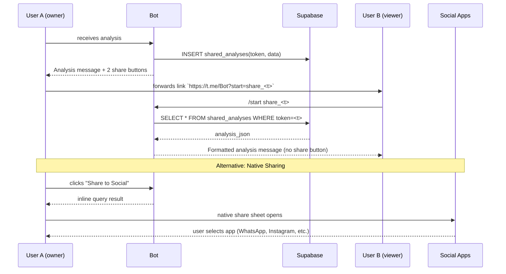

# 04 – Deep-Link Flow

## Two Sharing Options

### 1. Deep-link (Telegram-to-Telegram)
- Works within Telegram ecosystem
- Preserves full formatting and emojis
- Requires bot to be available to viewer

### 2. Native Sharing (Cross-platform)
- Uses device's native share sheet
- Works with any installed social app
- Text-only sharing with hashtags
- Better for social media discovery

Edge Cases
1. **Expired token** – bot replies with "Link expired".
2. **Token not found** – "Invalid share link".
3. **Token reused** – allowed; multiple viewers OK.
4. **Owner deletes account** – data auto-purged by foreign-key cascade.
5. **Inline mode disabled** – native share button hidden or shows error.

Note: Share buttons only appear in the original analysis message, not in shared copies. 