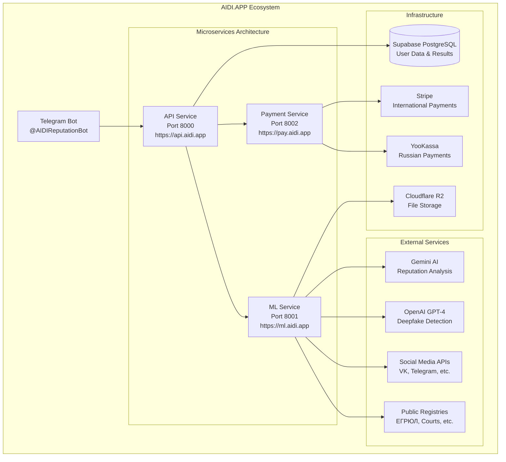

# Архитектурный дизайн AIDI.APP

*Дата создания: 27 января 2025*
*Цель: Детальный план архитектуры сервиса оценки репутации и KYC*

## 🏗️ Общая архитектура системы



## 🔄 FSM (Finite State Machine) - 3 состояния

### Диаграмма состояний

```mermaid
stateDiagram-v2
    [*] --> Default
    
    Default --> ReputationAnalysis : 🔍 Анализ репутации
    Default --> DeepfakeDetection : 🎭 Проверка дипфейка
    Default --> Profile : 👤 Профиль
    Default --> Help : ❓ Помощь
    
    ReputationAnalysis --> Default : ⬅️ Главное меню
    ReputationAnalysis --> ReputationAnalysis : 🔄 Новый анализ
    ReputationAnalysis --> DeepfakeDetection : 🎭 Проверить дипфейк
    
    DeepfakeDetection --> Default : ⬅️ Главное меню
    DeepfakeDetection --> ReputationAnalysis : 🔍 Анализ репутации
    DeepfakeDetection --> DeepfakeDetection : 🔄 Новая проверка
    
    Profile --> Default : ⬅️ Главное меню
    Help --> Default : ⬅️ Главное меenu
```

### Детальное описание состояний

#### 1. Default State (Основное меню)
**Функции:**
- Приветствие пользователя
- Отображение основного меню
- Навигация по функциям
- Управление профилем
- Покупка кредитов

**Клавиатура:**
```
🔍 Анализ репутации    🎭 Проверка дипфейка
👤 Профиль            💳 Купить кредиты
📊 История анализов    ❓ Помощь
🌐 Язык: Русский      ⚙️ Настройки
```

#### 2. Reputation Analysis State (Анализ репутации)
**Функции:**
- Ввод данных для анализа (ФИО, телефон, email, фото)
- Выбор глубины анализа (базовый/расширенный)
- Отображение результатов анализа
- Сохранение отчетов

**Подсостояния:**
- `waiting_for_input` - ожидание данных
- `processing` - обработка запроса
- `showing_results` - отображение результатов
- `saving_report` - сохранение отчета

**Клавиатура (ввод данных):**
```
📝 Ввести ФИО          📞 Ввести телефон
📧 Ввести email        📷 Загрузить фото
🔍 Базовый анализ      🔬 Расширенный анализ
⬅️ Главное меню        🔄 Очистить данные
```

#### 3. Deepfake Detection State (Проверка дипфейка)
**Функции:**
- Загрузка видео/фото для анализа
- Выбор типа анализа (быстрый/детальный)
- AI-анализ на предмет дипфейка
- Отображение результатов с процентом уверенности

**Подсостояния:**
- `waiting_for_media` - ожидание медиафайла
- `analyzing` - анализ дипфейка
- `showing_results` - результаты анализа

**Клавиатура (загрузка медиа):**
```
📷 Загрузить фото      🎥 Загрузить видео
⚡ Быстрый анализ      🔬 Детальный анализ
⬅️ Главное меню        🔄 Новый файл
```

## 🛠️ Архитектура сервисов

### API Service (Port 8000) - https://api.aidi.app

**Структура:**
```
services/api/
├── bot/                           # Telegram Bot
│   ├── handlers/
│   │   ├── default.py            # Default state handlers
│   │   ├── reputation.py         # Reputation analysis handlers
│   │   ├── deepfake.py           # Deepfake detection handlers
│   │   ├── profile.py            # User profile handlers
│   │   ├── payments.py           # Payment handlers
│   │   └── admin.py              # Admin handlers
│   ├── keyboards/
│   │   ├── default.py            # Main menu keyboards
│   │   ├── reputation.py         # Reputation keyboards
│   │   ├── deepfake.py           # Deepfake keyboards
│   │   ├── profile.py            # Profile keyboards
│   │   └── payments.py           # Payment keyboards
│   ├── states/
│   │   ├── default.py            # Default FSM states
│   │   ├── reputation.py         # Reputation FSM states
│   │   └── deepfake.py           # Deepfake FSM states
│   ├── middleware/
│   │   ├── auth.py               # User authentication
│   │   ├── credits.py            # Credit validation
│   │   ├── i18n.py               # Internationalization
│   │   └── logging.py            # Request logging
│   └── utils/
│       ├── validators.py         # Input validation
│       ├── formatters.py         # Response formatting
│       └── helpers.py            # Helper functions
│
├── edge/                          # Edge API (Cloudflare Workers)
│   ├── worker.ts                 # Main worker
│   └── lib/
│       ├── reputation.ts         # Reputation API endpoints
│       ├── deepfake.ts           # Deepfake API endpoints
│       ├── supabase.ts           # Database integration
│       └── r2.ts                 # File storage
│
└── shared/                        # Shared API components
    ├── contracts/                # Service contracts
    ├── models/                   # Data models
    └── utils/                    # Shared utilities
```

### ML Service (Port 8001) - https://ml.aidi.app

**Структура:**
```
services/ml/
├── reputation/                    # Reputation analysis
│   ├── analyzer.py               # Main reputation analyzer
│   ├── data_sources/             # Data source integrations
│   │   ├── social_media.py       # Social media APIs
│   │   ├── public_registries.py  # Public registries
│   │   ├── news_sources.py       # News and media
│   │   └── court_records.py      # Court records
│   ├── scoring/                  # Reputation scoring
│   │   ├── risk_calculator.py    # Risk assessment
│   │   ├── sentiment_analyzer.py # Sentiment analysis
│   │   └── credibility_scorer.py # Credibility scoring
│   └── reports/                  # Report generation
│       ├── generator.py          # Report generator
│       └── templates/            # Report templates
│
├── deepfake/                      # Deepfake detection
│   ├── detector.py               # Main deepfake detector
│   ├── video_analyzer.py         # Video analysis
│   ├── image_analyzer.py         # Image analysis
│   ├── models/                   # AI models
│   │   ├── face_detection.py     # Face detection
│   │   ├── temporal_analysis.py  # Temporal inconsistencies
│   │   └── artifact_detection.py # Artifact detection
│   └── utils/                    # Detection utilities
│       ├── preprocessing.py      # Media preprocessing
│       └── postprocessing.py     # Result processing
│
├── ai_clients/                    # AI service clients
│   ├── gemini/
│   │   ├── client.py             # Gemini client
│   │   ├── reputation_prompts.py # Reputation analysis prompts
│   │   └── config.py             # Gemini configuration
│   ├── openai/
│   │   ├── client.py             # OpenAI client
│   │   ├── deepfake_prompts.py   # Deepfake detection prompts
│   │   └── config.py             # OpenAI configuration
│   └── shared/
│       ├── rate_limiter.py       # API rate limiting
│       └── error_handler.py      # Error handling
│
└── shared/                        # Shared ML components
    ├── models/                   # Data models
    ├── utils/                    # ML utilities
    └── cache/                    # Caching layer
```

### Payment Service (Port 8002) - https://pay.aidi.app

**Структура остается той же, что и в c0r.ai:**
```
services/pay/
├── stripe/                       # Stripe integration
├── yookassa/                     # YooKassa integration
├── shared/                       # Shared payment components
└── templates/                    # Payment templates
```

## 🗄️ База данных - новая схема

### Основные таблицы

#### users (пользователи)
```sql
CREATE TABLE users (
    id UUID PRIMARY KEY DEFAULT gen_random_uuid(),
    telegram_id BIGINT UNIQUE NOT NULL,
    username VARCHAR(255),
    first_name VARCHAR(255),
    last_name VARCHAR(255),
    language_code VARCHAR(10) DEFAULT 'ru',
    is_premium BOOLEAN DEFAULT FALSE,
    created_at TIMESTAMP WITH TIME ZONE DEFAULT NOW(),
    updated_at TIMESTAMP WITH TIME ZONE DEFAULT NOW()
);
```

#### user_profiles (профили пользователей)
```sql
CREATE TABLE user_profiles (
    id UUID PRIMARY KEY DEFAULT gen_random_uuid(),
    user_id UUID REFERENCES users(id) ON DELETE CASCADE,
    notification_settings JSONB DEFAULT '{}',
    privacy_settings JSONB DEFAULT '{}',
    subscription_type VARCHAR(50) DEFAULT 'free',
    subscription_expires_at TIMESTAMP WITH TIME ZONE,
    created_at TIMESTAMP WITH TIME ZONE DEFAULT NOW(),
    updated_at TIMESTAMP WITH TIME ZONE DEFAULT NOW()
);
```

#### reputation_analyses (анализы репутации)
```sql
CREATE TABLE reputation_analyses (
    id UUID PRIMARY KEY DEFAULT gen_random_uuid(),
    user_id UUID REFERENCES users(id) ON DELETE CASCADE,
    target_name VARCHAR(255),
    target_phone VARCHAR(50),
    target_email VARCHAR(255),
    target_photo_url TEXT,
    analysis_type VARCHAR(50) NOT NULL, -- 'basic', 'extended'
    status VARCHAR(50) DEFAULT 'pending', -- 'pending', 'processing', 'completed', 'failed'
    results JSONB,
    risk_score INTEGER, -- 0-100
    credibility_score INTEGER, -- 0-100
    sentiment_score DECIMAL(3,2), -- -1.00 to 1.00
    sources_found INTEGER DEFAULT 0,
    credits_used INTEGER DEFAULT 1,
    processing_time_ms INTEGER,
    created_at TIMESTAMP WITH TIME ZONE DEFAULT NOW(),
    completed_at TIMESTAMP WITH TIME ZONE
);
```

#### deepfake_detections (детекция дипфейков)
```sql
CREATE TABLE deepfake_detections (
    id UUID PRIMARY KEY DEFAULT gen_random_uuid(),
    user_id UUID REFERENCES users(id) ON DELETE CASCADE,
    media_url TEXT NOT NULL,
    media_type VARCHAR(20) NOT NULL, -- 'image', 'video'
    file_size_bytes BIGINT,
    analysis_type VARCHAR(50) NOT NULL, -- 'quick', 'detailed'
    status VARCHAR(50) DEFAULT 'pending',
    deepfake_probability DECIMAL(5,4), -- 0.0000 to 1.0000
    confidence_score DECIMAL(5,4), -- 0.0000 to 1.0000
    detection_details JSONB,
    processing_time_ms INTEGER,
    credits_used INTEGER DEFAULT 1,
    created_at TIMESTAMP WITH TIME ZONE DEFAULT NOW(),
    completed_at TIMESTAMP WITH TIME ZONE
);
```

#### reputation_sources (источники данных)
```sql
CREATE TABLE reputation_sources (
    id UUID PRIMARY KEY DEFAULT gen_random_uuid(),
    analysis_id UUID REFERENCES reputation_analyses(id) ON DELETE CASCADE,
    source_type VARCHAR(100) NOT NULL, -- 'vk', 'telegram', 'court_records', etc.
    source_url TEXT,
    data_found JSONB,
    relevance_score DECIMAL(3,2), -- 0.00 to 1.00
    sentiment DECIMAL(3,2), -- -1.00 to 1.00
    created_at TIMESTAMP WITH TIME ZONE DEFAULT NOW()
);
```

#### credits (система кредитов)
```sql
CREATE TABLE credits (
    id UUID PRIMARY KEY DEFAULT gen_random_uuid(),
    user_id UUID REFERENCES users(id) ON DELETE CASCADE,
    amount INTEGER NOT NULL,
    transaction_type VARCHAR(50) NOT NULL, -- 'purchase', 'usage', 'refund', 'bonus'
    description TEXT,
    related_analysis_id UUID, -- может ссылаться на reputation_analyses или deepfake_detections
    created_at TIMESTAMP WITH TIME ZONE DEFAULT NOW()
);
```

#### payments (платежи)
```sql
CREATE TABLE payments (
    id UUID PRIMARY KEY DEFAULT gen_random_uuid(),
    user_id UUID REFERENCES users(id) ON DELETE CASCADE,
    amount DECIMAL(10,2) NOT NULL,
    currency VARCHAR(3) NOT NULL,
    credits_purchased INTEGER NOT NULL,
    payment_method VARCHAR(50) NOT NULL, -- 'stripe', 'yookassa'
    payment_id VARCHAR(255) UNIQUE NOT NULL,
    status VARCHAR(50) DEFAULT 'pending',
    metadata JSONB,
    created_at TIMESTAMP WITH TIME ZONE DEFAULT NOW(),
    completed_at TIMESTAMP WITH TIME ZONE
);
```

## 🔌 API Endpoints

### Reputation Analysis API

#### POST /api/v1/reputation/analyze
```json
{
  "target_name": "Иван Иванов",
  "target_phone": "+79001234567",
  "target_email": "ivan@example.com",
  "target_photo": "base64_encoded_image",
  "analysis_type": "extended"
}
```

#### GET /api/v1/reputation/analysis/{analysis_id}
```json
{
  "id": "uuid",
  "status": "completed",
  "risk_score": 25,
  "credibility_score": 85,
  "sentiment_score": 0.65,
  "sources_found": 12,
  "results": {
    "social_media": {...},
    "public_records": {...},
    "news_mentions": {...}
  }
}
```

### Deepfake Detection API

#### POST /api/v1/deepfake/detect
```json
{
  "media_url": "https://r2.aidi.app/uploads/video.mp4",
  "media_type": "video",
  "analysis_type": "detailed"
}
```

#### GET /api/v1/deepfake/detection/{detection_id}
```json
{
  "id": "uuid",
  "status": "completed",
  "deepfake_probability": 0.8750,
  "confidence_score": 0.9200,
  "detection_details": {
    "face_inconsistencies": 0.85,
    "temporal_artifacts": 0.92,
    "compression_artifacts": 0.78
  }
}
```

## 🤖 AI Integration Strategy

### Gemini AI для анализа репутации
**Возможности:**
- Multimodal анализ (текст + изображения)
- Sentiment analysis публикаций
- Контекстный анализ упоминаний
- Оценка достоверности источников

**Промпты:**
```python
REPUTATION_ANALYSIS_PROMPT = """
Проанализируй репутацию человека на основе следующих данных:
- Социальные сети: {social_data}
- Публичные записи: {public_records}
- Упоминания в СМИ: {news_mentions}

Оцени:
1. Риск-скор (0-100)
2. Достоверность (0-100)
3. Тональность (-1.0 до 1.0)
4. Ключевые находки
"""
```

### OpenAI для детекции дипфейков
**Возможности:**
- GPT-4 Vision для анализа изображений
- Детекция артефактов сжатия
- Анализ временных несоответствий
- Оценка качества синтеза

**Промпты:**
```python
DEEPFAKE_DETECTION_PROMPT = """
Проанализируй медиафайл на предмет дипфейка:
- Тип медиа: {media_type}
- Метаданные: {metadata}
- Визуальные артефакты: {artifacts}

Определи:
1. Вероятность дипфейка (0.0-1.0)
2. Уверенность в оценке (0.0-1.0)
3. Обнаруженные артефакты
4. Рекомендации
"""
```

## 🔒 Безопасность и приватность

### Защита данных
- Шифрование персональных данных
- Автоматическое удаление через 30 дней
- Соблюдение GDPR и 152-ФЗ
- Анонимизация аналитики

### Rate Limiting
- 10 запросов в минуту для базовых пользователей
- 50 запросов в минуту для премиум пользователей
- Защита от DDoS атак

## 📊 Мониторинг и аналитика

### Метрики производительности
- Время обработки запросов
- Точность AI-анализа
- Использование кредитов
- Конверсия платежей

### Логирование
- Структурированные логи в JSON
- Отслеживание пользовательских действий
- Мониторинг ошибок AI сервисов
- Аудит доступа к данным

## 🎯 Выводы

Архитектура AIDI.APP построена на проверенной основе c0r.ai с адаптацией под новые требования:

1. **3-state FSM** обеспечивает интуитивную навигацию
2. **Микросервисная архитектура** позволяет независимое масштабирование
3. **AI-интеграция** обеспечивает высокое качество анализа
4. **Безопасность** соответствует требованиям обработки персональных данных
5. **Масштабируемость** готова к росту пользовательской базы