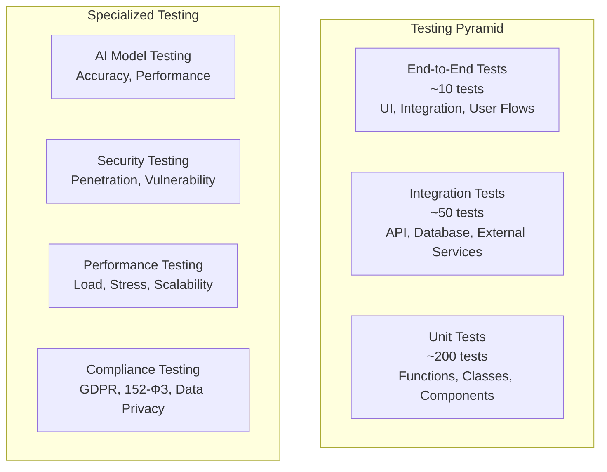

# Стратегия тестирования AIDI.APP

*Дата создания: 27 января 2025*
*Цель: Комплексная стратегия тестирования сервиса репутации и KYC*

## 🎯 Обзор стратегии тестирования

Стратегия тестирования AIDI.APP охватывает все уровни приложения - от unit тестов до end-to-end тестирования в продакшене. Особое внимание уделяется тестированию AI-компонентов, безопасности данных и производительности системы.

### Пирамида тестирования



## 🧪 Unit тестирование

### Структура unit тестов

```
tests/unit/
├── test_reputation_analysis.py      # Тесты анализа репутации
├── test_deepfake_detection.py       # Тесты детекции дипфейков
├── test_kyc_verification.py         # Тесты KYC верификации
├── test_bot_handlers.py             # Тесты Telegram bot handlers
├── test_fsm_states.py               # Тесты FSM состояний
├── test_payment_processing.py       # Тесты платежной системы
├── test_credit_system.py            # Тесты системы кредитов
├── test_ai_clients.py               # Тесты AI клиентов
├── test_data_validation.py          # Тесты валидации данных
└── test_security_utils.py           # Тесты безопасности
```

### Примеры unit тестов

#### Тестирование анализа репутации
```python
# tests/unit/test_reputation_analysis.py
import pytest
import sys
import os
sys.path.insert(0, os.path.abspath(os.path.join(os.path.dirname(__file__), '..', '..')))

from services.ml.reputation.analyzer import ReputationAnalyzer
from services.ml.reputation.scoring.risk_calculator import RiskCalculator

class TestReputationAnalysis:
    """Тесты функциональности анализа репутации"""
    
    def setup_method(self):
        """Настройка перед каждым тестом"""
        self.analyzer = ReputationAnalyzer()
        self.risk_calculator = RiskCalculator()
        
    def test_basic_reputation_analysis_with_valid_data(self):
        """Тест базового анализа репутации с корректными данными"""
        # Arrange
        input_data = {
            "target_name": "Иван Иванов",
            "target_phone": "+79001234567",
            "analysis_type": "basic"
        }
        
        # Act
        result = self.analyzer.analyze_person(input_data)
        
        # Assert
        assert result is not None
        assert "risk_score" in result
        assert "credibility_score" in result
        assert 0 <= result["risk_score"] <= 100
        assert 0 <= result["credibility_score"] <= 100
        
    def test_risk_score_calculation_with_negative_indicators(self):
        """Тест расчета риск-скора с негативными индикаторами"""
        # Arrange
        data = {
            "court_records": [{"type": "criminal", "severity": "high"}],
            "negative_news": [{"sentiment": -0.8, "source": "reliable"}],
            "social_red_flags": ["suspicious_activity", "fake_profiles"]
        }
        
        # Act
        risk_score = self.risk_calculator.calculate_risk_score(data)
        
        # Assert
        assert risk_score > 60  # Высокий риск
        assert isinstance(risk_score, int)
        
    def test_sentiment_analysis_with_mixed_content(self):
        """Тест анализа тональности со смешанным контентом"""
        # Arrange
        content = [
            {"text": "Отличный специалист, рекомендую!", "source": "review"},
            {"text": "Были проблемы с выполнением работы", "source": "complaint"},
            {"text": "Нейтральная информация о работе", "source": "news"}
        ]
        
        # Act
        sentiment_score = self.analyzer.analyze_sentiment(content)
        
        # Assert
        assert -1.0 <= sentiment_score <= 1.0
        assert isinstance(sentiment_score, float)
        
    def test_reputation_analysis_with_insufficient_data(self):
        """Тест анализа репутации с недостаточными данными"""
        # Arrange
        input_data = {
            "target_name": "",  # Пустое имя
            "analysis_type": "basic"
        }
        
        # Act & Assert
        with pytest.raises(ValueError, match="Insufficient data"):
            self.analyzer.analyze_person(input_data)
            
    def test_data_source_integration(self):
        """Тест интеграции с источниками данных"""
        # Arrange
        search_params = {
            "name": "Тестовый Пользователь",
            "sources": ["vk", "public_records"]
        }
        
        # Act
        sources_data = self.analyzer.collect_data_from_sources(search_params)
        
        # Assert
        assert isinstance(sources_data, dict)
        assert "vk" in sources_data or "public_records" in sources_data
        for source, data in sources_data.items():
            assert "relevance_score" in data
            assert 0.0 <= data["relevance_score"] <= 1.0
```

#### Тестирование детекции дипфейков
```python
# tests/unit/test_deepfake_detection.py
import pytest
from unittest.mock import Mock, patch
from services.ml.deepfake.detector import DeepfakeDetector

class TestDeepfakeDetection:
    """Тесты функциональности детекции дипфейков"""
    
    def setup_method(self):
        """Настройка перед каждым тестом"""
        self.detector = DeepfakeDetector()
        
    def test_image_deepfake_detection_authentic(self):
        """Тест детекции дипфейка для подлинного изображения"""
        # Arrange
        image_path = "tests/fixtures/authentic_image.jpg"
        
        # Act
        result = self.detector.analyze_image(image_path)
        
        # Assert
        assert result is not None
        assert "deepfake_probability" in result
        assert "confidence_score" in result
        assert 0.0 <= result["deepfake_probability"] <= 1.0
        assert 0.0 <= result["confidence_score"] <= 1.0
        
    def test_video_deepfake_detection_with_temporal_analysis(self):
        """Тест детекции дипфейка в видео с временным анализом"""
        # Arrange
        video_path = "tests/fixtures/test_video.mp4"
        
        # Act
        result = self.detector.analyze_video(video_path)
        
        # Assert
        assert "temporal_analysis" in result
        assert "face_analysis" in result
        assert "compression_analysis" in result
        assert result["temporal_analysis"]["inconsistencies_found"] is not None
        
    def test_confidence_scoring_algorithm(self):
        """Тест алгоритма расчета уверенности"""
        # Arrange
        detection_results = {
            "face_inconsistencies": 0.3,
            "temporal_artifacts": 0.2,
            "compression_artifacts": 0.1,
            "metadata_analysis": 0.05
        }
        
        # Act
        confidence = self.detector.calculate_confidence(detection_results)
        
        # Assert
        assert 0.0 <= confidence <= 1.0
        assert isinstance(confidence, float)
        
    def test_unsupported_media_format(self):
        """Тест обработки неподдерживаемого формата медиа"""
        # Arrange
        unsupported_file = "tests/fixtures/document.pdf"
        
        # Act & Assert
        with pytest.raises(ValueError, match="Unsupported media format"):
            self.detector.analyze_image(unsupported_file)
            
    @patch('services.ml.ai_clients.openai.client.OpenAIDeepfakeClient')
    def test_ai_model_integration(self, mock_openai_client):
        """Тест интеграции с AI моделью"""
        # Arrange
        mock_openai_client.return_value.detect_deepfake_image.return_value = {
            "deepfake_probability": 0.85,
            "confidence": 0.92,
            "explanation": "High probability deepfake detected"
        }
        
        # Act
        result = self.detector.detect_deepfake("test_image.jpg")
        
        # Assert
        assert result["deepfake_probability"] == 0.85
        assert result["confidence"] == 0.92
        mock_openai_client.return_value.detect_deepfake_image.assert_called_once()
```

#### Тестирование Telegram bot
```python
# tests/unit/test_bot_handlers.py
import pytest
from unittest.mock import AsyncMock, Mock
from aiogram.types import Message, User, Chat
from services.api.bot.handlers.reputation import ReputationHandler

class TestBotHandlers:
    """Тесты обработчиков Telegram бота"""
    
    def setup_method(self):
        """Настройка перед каждым тестом"""
        self.handler = ReputationHandler()
        
    @pytest.fixture
    def mock_message(self):
        """Фикстура для создания mock сообщения"""
        user = User(id=12345, is_bot=False, first_name="Test", username="testuser")
        chat = Chat(id=12345, type="private")
        return Message(
            message_id=1,
            date=None,
            chat=chat,
            from_user=user,
            content_type="text",
            text="test message"
        )
        
    @pytest.mark.asyncio
    async def test_reputation_menu_handler(self, mock_message):
        """Тест обработчика меню репутации"""
        # Arrange
        mock_message.text = "🔍 Анализ репутации"
        
        # Act
        result = await self.handler.handle_reputation_menu(mock_message)
        
        # Assert
        assert result is not None
        assert "reputation analysis" in result.lower() or "анализ репутации" in result.lower()
        
    @pytest.mark.asyncio
    async def test_data_input_validation(self, mock_message):
        """Тест валидации ввода данных"""
        # Arrange
        mock_message.text = "invalid_email_format"
        
        # Act
        result = await self.handler.validate_email_input(mock_message)
        
        # Assert
        assert result["valid"] is False
        assert "error" in result
        
    @pytest.mark.asyncio
    async def test_fsm_state_transition(self, mock_message):
        """Тест переходов между состояниями FSM"""
        # Arrange
        from aiogram.fsm.context import FSMContext
        mock_state = AsyncMock(spec=FSMContext)
        
        # Act
        await self.handler.start_reputation_analysis(mock_message, mock_state)
        
        # Assert
        mock_state.set_state.assert_called_once()
```

## 🔗 Integration тестирование

### Структура integration тестов

```
tests/integration/
├── test_api_endpoints.py            # Тесты API endpoints
├── test_database_operations.py      # Тесты операций с БД
├── test_external_services.py        # Тесты внешних сервисов
├── test_payment_flow.py             # Тесты платежного потока
├── test_telegram_integration.py     # Тесты интеграции с Telegram
├── test_ai_service_integration.py   # Тесты интеграции с AI сервисами
├── test_file_storage.py             # Тесты файлового хранилища
└── test_notification_system.py      # Тесты системы уведомлений
```

### Примеры integration тестов

#### Тестирование API endpoints
```python
# tests/integration/test_api_endpoints.py
import pytest
import httpx
import asyncio
from fastapi.testclient import TestClient
from services.api.main import app

class TestAPIEndpoints:
    """Интеграционные тесты API endpoints"""
    
    def setup_method(self):
        """Настройка перед каждым тестом"""
        self.client = TestClient(app)
        self.base_url = "http://testserver"
        
    def test_reputation_analysis_endpoint(self):
        """Тест endpoint анализа репутации"""
        # Arrange
        payload = {
            "target_name": "Тест Тестов",
            "target_phone": "+79001234567",
            "analysis_type": "basic"
        }
        headers = {"Authorization": "Bearer test_token"}
        
        # Act
        response = self.client.post(
            "/api/v1/reputation/analyze",
            json=payload,
            headers=headers
        )
        
        # Assert
        assert response.status_code == 200
        data = response.json()
        assert "analysis_id" in data
        assert "status" in data
        assert data["status"] == "pending"
        
    def test_deepfake_detection_endpoint(self):
        """Тест endpoint детекции дипфейков"""
        # Arrange
        files = {"media": ("test.jpg", open("tests/fixtures/test_image.jpg", "rb"), "image/jpeg")}
        data = {"analysis_type": "quick"}
        
        # Act
        response = self.client.post(
            "/api/v1/deepfake/detect",
            files=files,
            data=data
        )
        
        # Assert
        assert response.status_code == 200
        result = response.json()
        assert "detection_id" in result
        assert "status" in result
        
    def test_analysis_status_endpoint(self):
        """Тест endpoint статуса анализа"""
        # Arrange
        analysis_id = "test-analysis-id-123"
        
        # Act
        response = self.client.get(f"/api/v1/reputation/analysis/{analysis_id}")
        
        # Assert
        assert response.status_code in [200, 404]  # 404 если анализ не найден
        
    def test_credit_balance_endpoint(self):
        """Тест endpoint баланса кредитов"""
        # Arrange
        headers = {"Authorization": "Bearer test_token"}
        
        # Act
        response = self.client.get("/api/v1/user/credits", headers=headers)
        
        # Assert
        assert response.status_code == 200
        data = response.json()
        assert "balance" in data
        assert isinstance(data["balance"], int)
```

#### Тестирование базы данных
```python
# tests/integration/test_database_operations.py
import pytest
import asyncpg
from services.common.database.models import User, ReputationAnalysis
from services.common.database.connection import get_db_connection

class TestDatabaseOperations:
    """Интеграционные тесты операций с базой данных"""
    
    @pytest.fixture
    async def db_connection(self):
        """Фикстура подключения к тестовой БД"""
        conn = await get_db_connection(test_mode=True)
        yield conn
        await conn.close()
        
    @pytest.mark.asyncio
    async def test_user_creation_and_retrieval(self, db_connection):
        """Тест создания и получения пользователя"""
        # Arrange
        user_data = {
            "telegram_id": 123456789,
            "username": "testuser",
            "first_name": "Test",
            "last_name": "User"
        }
        
        # Act - Create user
        user_id = await User.create(db_connection, **user_data)
        
        # Act - Retrieve user
        user = await User.get_by_telegram_id(db_connection, 123456789)
        
        # Assert
        assert user is not None
        assert user["telegram_id"] == 123456789
        assert user["username"] == "testuser"
        
    @pytest.mark.asyncio
    async def test_reputation_analysis_workflow(self, db_connection):
        """Тест полного workflow анализа репутации"""
        # Arrange
        user_id = await User.create(db_connection, telegram_id=987654321, first_name="Test")
        analysis_data = {
            "user_id": user_id,
            "target_name": "Анализируемый Пользователь",
            "analysis_type": "basic",
            "status": "pending"
        }
        
        # Act - Create analysis
        analysis_id = await ReputationAnalysis.create(db_connection, **analysis_data)
        
        # Act - Update status
        await ReputationAnalysis.update_status(db_connection, analysis_id, "processing")
        
        # Act - Complete analysis
        results = {
            "risk_score": 25,
            "credibility_score": 85,
            "sentiment_score": 0.6,
            "sources_found": 12
        }
        await ReputationAnalysis.complete(db_connection, analysis_id, results)
        
        # Assert
        analysis = await ReputationAnalysis.get_by_id(db_connection, analysis_id)
        assert analysis["status"] == "completed"
        assert analysis["risk_score"] == 25
        assert analysis["credibility_score"] == 85
        
    @pytest.mark.asyncio
    async def test_credit_transactions(self, db_connection):
        """Тест транзакций кредитов"""
        # Arrange
        user_id = await User.create(db_connection, telegram_id=555666777, first_name="Credit Test")
        
        # Act - Add credits
        await Credit.add_credits(db_connection, user_id, 100, "purchase", "Test purchase")
        
        # Act - Use credits
        await Credit.use_credits(db_connection, user_id, 5, "reputation_analysis", "Basic analysis")
        
        # Act - Get balance
        balance = await Credit.get_balance(db_connection, user_id)
        
        # Assert
        assert balance == 95
        
        # Act - Get transaction history
        transactions = await Credit.get_transactions(db_connection, user_id)
        assert len(transactions) == 2
        assert transactions[0]["transaction_type"] == "purchase"
        assert transactions[1]["transaction_type"] == "reputation_analysis"
```

## 🌐 End-to-End тестирование

### E2E тестовые сценарии

```python
# tests/e2e/test_user_journey.py
import pytest
from playwright.async_api import async_playwright
import asyncio

class TestUserJourney:
    """End-to-end тесты пользовательских сценариев"""
    
    @pytest.mark.asyncio
    async def test_complete_reputation_analysis_flow(self):
        """Полный E2E тест анализа репутации"""
        async with async_playwright() as p:
            # Arrange
            browser = await p.chromium.launch(headless=False)
            context = await browser.new_context()
            page = await context.new_page()
            
            try:
                # Act 1: Open Telegram Web and start bot
                await page.goto("https://web.telegram.org")
                await page.wait_for_selector('[data-testid="search-input"]')
                await page.fill('[data-testid="search-input"]', "@AIDIReputationBot")
                await page.press('[data-testid="search-input"]', "Enter")
                
                # Act 2: Start conversation
                await page.click('[data-testid="start-button"]')
                await page.wait_for_selector('[data-testid="message-text"]')
                
                # Act 3: Navigate to reputation analysis
                await page.click('text="🔍 Анализ репутации"')
                
                # Act 4: Enter analysis data
                await page.click('text="📝 Ввести имя"')
                await page.fill('[data-testid="message-input"]', "Тест Тестович")
                await page.press('[data-testid="message-input"]', "Enter")
                
                # Act 5: Start analysis
                await page.click('text="🚀 Начать анализ"')
                
                # Act 6: Wait for results
                await page.wait_for_selector('text="✅ Анализ завершен"', timeout=60000)
                
                # Assert
                analysis_result = await page.text_content('[data-testid="analysis-result"]')
                assert "Риск-скор:" in analysis_result
                assert "Достоверность:" in analysis_result
                
            finally:
                await browser.close()
                
    @pytest.mark.asyncio
    async def test_payment_and_credit_purchase_flow(self):
        """E2E тест покупки кредитов"""
        # Тест покупки кредитов через Stripe/YooKassa
        # Включает весь flow от выбора пакета до зачисления кредитов
        pass
        
    @pytest.mark.asyncio
    async def test_deepfake_detection_flow(self):
        """E2E тест детекции дипфейков"""
        # Тест загрузки медиафайла и получения результатов детекции
        pass
```

## 🤖 AI Model тестирование

### Тестирование точности AI моделей

```python
# tests/ai/test_model_accuracy.py
import pytest
import numpy as np
from sklearn.metrics import accuracy_score, precision_score, recall_score
from services.ml.deepfake.detector import DeepfakeDetector
from services.ml.reputation.analyzer import ReputationAnalyzer

class TestAIModelAccuracy:
    """Тесты точности AI моделей"""
    
    def setup_method(self):
        """Настройка тестовых данных"""
        self.deepfake_detector = DeepfakeDetector()
        self.reputation_analyzer = ReputationAnalyzer()
        
    def test_deepfake_detection_accuracy(self):
        """Тест точности детекции дипфейков"""
        # Arrange - загружаем тестовый датасет
        test_dataset = self.load_deepfake_test_dataset()
        predictions = []
        ground_truth = []
        
        # Act
        for sample in test_dataset:
            result = self.deepfake_detector.detect_deepfake(sample["media_path"])
            predictions.append(1 if result["deepfake_probability"] > 0.5 else 0)
            ground_truth.append(sample["is_deepfake"])
            
        # Assert
        accuracy = accuracy_score(ground_truth, predictions)
        precision = precision_score(ground_truth, predictions)
        recall = recall_score(ground_truth, predictions)
        
        assert accuracy >= 0.90  # Минимум 90% точности
        assert precision >= 0.85  # Минимум 85% precision
        assert recall >= 0.85     # Минимум 85% recall
        
    def test_reputation_scoring_consistency(self):
        """Тест консистентности скоринга репутации"""
        # Arrange
        test_profiles = self.load_reputation_test_profiles()
        
        # Act - анализируем каждый профиль несколько раз
        for profile in test_profiles:
            scores = []
            for _ in range(5):  # 5 повторных анализов
                result = self.reputation_analyzer.analyze_person(profile)
                scores.append(result["risk_score"])
                
            # Assert - проверяем консистентность (разброс не более 10 пунктов)
            score_std = np.std(scores)
            assert score_std <= 10, f"Inconsistent scoring for profile {profile['name']}"
            
    def load_deepfake_test_dataset(self):
        """Загрузка тестового датасета для дипфейков"""
        return [
            {"media_path": "tests/fixtures/authentic_video1.mp4", "is_deepfake": 0},
            {"media_path": "tests/fixtures/deepfake_video1.mp4", "is_deepfake": 1},
            # ... больше тестовых образцов
        ]
        
    def load_reputation_test_profiles(self):
        """Загрузка тестовых профилей для анализа репутации"""
        return [
            {"name": "Положительный Профиль", "expected_risk": "low"},
            {"name": "Негативный Профиль", "expected_risk": "high"},
            # ... больше тестовых профилей
        ]
```

## 🔒 Security тестирование

### Тесты безопасности

```python
# tests/security/test_security.py
import pytest
import requests
from services.api.main import app
from fastapi.testclient import TestClient

class TestSecurity:
    """Тесты безопасности приложения"""
    
    def setup_method(self):
        """Настройка перед каждым тестом"""
        self.client = TestClient(app)
        
    def test_sql_injection_protection(self):
        """Тест защиты от SQL инъекций"""
        # Arrange
        malicious_payload = {
            "target_name": "'; DROP TABLE users; --",
            "analysis_type": "basic"
        }
        
        # Act
        response = self.client.post("/api/v1/reputation/analyze", json=malicious_payload)
        
        # Assert
        assert response.status_code in [400, 422]  # Должен отклонить запрос
        
    def test_xss_protection(self):
        """Тест защиты от XSS атак"""
        # Arrange
        xss_payload = {
            "target_name": "<script>alert('XSS')</script>",
            "analysis_type": "basic"
        }
        
        # Act
        response = self.client.post("/api/v1/reputation/analyze", json=xss_payload)
        
        # Assert
        if response.status_code == 200:
            # Проверяем, что скрипт экранирован в ответе
            assert "<script>" not in response.text
            
    def test_rate_limiting(self):
        """Тест ограничения частоты запросов"""
        # Arrange
        payload = {"target_name": "Test User", "analysis_type": "basic"}
        
        # Act - отправляем много запросов подряд
        responses = []
        for _ in range(20):
            response = self.client.post("/api/v1/reputation/analyze", json=payload)
            responses.append(response.status_code)
            
        # Assert - должны получить 429 (Too Many Requests)
        assert 429 in responses
        
    def test_authentication_required(self):
        """Тест обязательной аутентификации"""
        # Act
        response = self.client.get("/api/v1/user/profile")
        
        # Assert
        assert response.status_code == 401  # Unauthorized
        
    def test_data_encryption_in_transit(self):
        """Тест шифрования данных при передаче"""
        # Проверяем, что все API endpoints используют HTTPS
        # В продакшене должны быть только HTTPS соединения
        pass
        
    def test_sensitive_data_not_logged(self):
        """Тест что чувствительные данные не попадают в логи"""
        # Arrange
        payload = {
            "target_name": "Секретное Имя",
            "target_phone": "+79001234567",
            "analysis_type": "basic"
        }
        
        # Act
        response = self.client.post("/api/v1/reputation/analyze", json=payload)
        
        # Assert - проверяем логи (в реальном тесте нужно проверить файлы логов)
        # Чувствительные данные не должны попадать в логи в открытом виде
        pass
```

## ⚡ Performance тестирование

### Нагрузочное тестирование

```python
# tests/performance/test_load.py
import asyncio
import aiohttp
import time
from concurrent.futures import ThreadPoolExecutor
import statistics

class TestPerformance:
    """Тесты производительности системы"""
    
    def test_concurrent_reputation_analyses(self):
        """Тест одновременных анализов репутации"""
        # Arrange
        concurrent_requests = 50
        base_url = "https://api.aidi.app"
        
        # Act
        start_time = time.time()
        with ThreadPoolExecutor(max_workers=concurrent_requests) as executor:
            futures = []
            for i in range(concurrent_requests):
                future = executor.submit(self.make_reputation_request, base_url, i)
                futures.append(future)
                
            results = [future.result() for future in futures]
        end_time = time.time()
        
        # Assert
        successful_requests = [r for r in results if r["success"]]
        response_times = [r["response_time"] for r in successful_requests]
        
        assert len(successful_requests) >= concurrent_requests * 0.95  # 95% success rate
        assert statistics.mean(response_times) <= 5.0  # Среднее время ответа <= 5 сек
        assert max(response_times) <= 15.0  # Максимальное время <= 15 сек
        
    def make_reputation_request(self, base_url, request_id):
        """Выполнение запроса анализа репутации"""
        