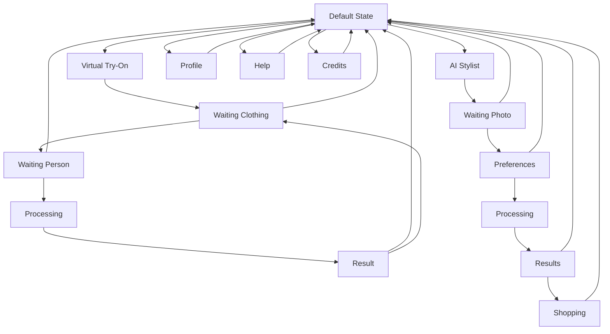

# MODERA.FASHION - Telegram Bot FSM Design

**Date:** 2025-01-27  
**Purpose:** Complete 3-state FSM design for MODERA.FASHION Telegram bot  
**Bot Username:** @ModeraFashionBot  

## FSM State Architecture

### State Management Overview

The bot implements a 3-state Finite State Machine (FSM) to handle different user workflows:

1. **Default State** - Main menu, navigation, profile management
2. **Virtual Try-On State** - Clothing fitting workflow
3. **AI Stylist State** - Style analysis and recommendations workflow

```python
from aiogram.fsm.state import State, StatesGroup

class ModeraFashionStates(StatesGroup):
    # === DEFAULT STATE ===
    default = State()
    
    # === VIRTUAL TRY-ON WORKFLOW ===
    tryon_waiting_clothing = State()
    tryon_waiting_person = State()
    tryon_processing = State()
    tryon_result = State()
    
    # === AI STYLIST WORKFLOW ===
    stylist_waiting_photo = State()
    stylist_preferences = State()
    stylist_processing = State()
    stylist_results = State()
    stylist_shopping = State()
```

## State Transition Diagram



## State Definitions and Handlers

### 1. Default State

#### Purpose
Main navigation hub where users can access all features, manage their profile, and get help.

#### Available Actions
- **Virtual Try-On** → Transition to `tryon_waiting_clothing`
- **AI Stylist** → Transition to `stylist_waiting_photo`
- **My Profile** → Show profile information (stay in default)
- **Credits** → Show credit balance and purchase options (stay in default)
- **Help** → Show help information (stay in default)
- **Settings** → Language and preferences (stay in default)

#### Keyboard Layout
```python
def get_default_keyboard(user_lang: str) -> InlineKeyboardMarkup:
    keyboard = InlineKeyboardBuilder()
    
    # Main features
    keyboard.row(
        InlineKeyboardButton(
            text=_("🔄 Virtual Try-On", locale=user_lang),
            callback_data="action:tryon"
        ),
        InlineKeyboardButton(
            text=_("🎨 AI Stylist", locale=user_lang),
            callback_data="action:stylist"
        )
    )
    
    # User management
    keyboard.row(
        InlineKeyboardButton(
            text=_("👤 My Profile", locale=user_lang),
            callback_data="action:profile"
        ),
        InlineKeyboardButton(
            text=_("💎 Credits", locale=user_lang),
            callback_data="action:credits"
        )
    )
    
    # Support
    keyboard.row(
        InlineKeyboardButton(
            text=_("❓ Help", locale=user_lang),
            callback_data="action:help"
        ),
        InlineKeyboardButton(
            text=_("⚙️ Settings", locale=user_lang),
            callback_data="action:settings"
        )
    )
    
    return keyboard.as_markup()
```

#### Handler Implementation
```python
@router.message(ModeraFashionStates.default)
async def handle_default_state(message: Message, state: FSMContext):
    user_lang = await get_user_language(message.from_user.id)
    
    await message.answer(
        text=_("welcome_main_menu", locale=user_lang),
        reply_markup=get_default_keyboard(user_lang)
    )

@router.callback_query(F.data.startswith("action:"))
async def handle_default_actions(callback: CallbackQuery, state: FSMContext):
    action = callback.data.split(":")[1]
    user_lang = await get_user_language(callback.from_user.id)
    
    if action == "tryon":
        await state.set_state(ModeraFashionStates.tryon_waiting_clothing)
        await callback.message.edit_text(
            text=_("tryon_upload_clothing", locale=user_lang),
            reply_markup=get_tryon_clothing_keyboard(user_lang)
        )
    elif action == "stylist":
        await state.set_state(ModeraFashionStates.stylist_waiting_photo)
        await callback.message.edit_text(
            text=_("stylist_upload_photo", locale=user_lang),
            reply_markup=get_stylist_photo_keyboard(user_lang)
        )
    # ... other actions
```

### 2. Virtual Try-On State Flow

#### State: `tryon_waiting_clothing`
**Purpose:** Collect clothing item image from user

**User Actions:**
- Upload clothing photo
- Select from catalog (future feature)
- Back to main menu

**Validation:**
- Image format (JPEG, PNG)
- Image size (max 10MB)
- Image content (clothing detection)

```python
@router.message(ModeraFashionStates.tryon_waiting_clothing, F.photo)
async def handle_clothing_upload(message: Message, state: FSMContext):
    user_lang = await get_user_language(message.from_user.id)
    
    # Validate image
    if not await validate_image(message.photo[-1]):
        await message.answer(_("error_invalid_image", locale=user_lang))
        return
    
    # Store clothing image
    clothing_url = await store_image(message.photo[-1], "clothing")
    await state.update_data(clothing_image_url=clothing_url)
    
    # Transition to next state
    await state.set_state(ModeraFashionStates.tryon_waiting_person)
    await message.answer(
        text=_("tryon_upload_person", locale=user_lang),
        reply_markup=get_tryon_person_keyboard(user_lang)
    )
```

#### State: `tryon_waiting_person`
**Purpose:** Collect person photo from user

**User Actions:**
- Upload person photo
- Back to clothing selection
- Back to main menu

**Validation:**
- Image format and size
- Person detection in image
- Face visibility check

```python
@router.message(ModeraFashionStates.tryon_waiting_person, F.photo)
async def handle_person_upload(message: Message, state: FSMContext):
    user_lang = await get_user_language(message.from_user.id)
    
    # Validate person image
    if not await validate_person_image(message.photo[-1]):
        await message.answer(_("error_no_person_detected", locale=user_lang))
        return
    
    # Check credits
    if not await check_user_credits(message.from_user.id, 3):
        await message.answer(
            text=_("error_insufficient_credits", locale=user_lang),
            reply_markup=get_buy_credits_keyboard(user_lang)
        )
        return
    
    # Store person image and start processing
    person_url = await store_image(message.photo[-1], "person")
    await state.update_data(person_image_url=person_url)
    
    # Transition to processing state
    await state.set_state(ModeraFashionStates.tryon_processing)
    await message.answer(
        text=_("tryon_processing", locale=user_lang),
        reply_markup=get_processing_keyboard(user_lang)
    )
    
    # Start AI processing
    await start_virtual_tryon_processing(message.from_user.id, state)
```

#### State: `tryon_processing`
**Purpose:** Show processing status while AI generates virtual try-on

**User Actions:**
- Cancel processing (return to main menu)
- View processing status

**Background Process:**
- Call ML service for virtual try-on generation
- Update processing status
- Handle AI processing errors

```python
async def start_virtual_tryon_processing(user_id: int, state: FSMContext):
    data = await state.get_data()
    session_id = str(uuid.uuid4())
    
    try:
        # Deduct credits
        await update_user_credits(user_id, -3, "usage", "tryon", session_id)
        
        # Call ML service
        result = await ml_service.virtual_tryon(
            clothing_image_url=data["clothing_image_url"],
            person_image_url=data["person_image_url"],
            user_id=user_id,
            session_id=session_id
        )
        
        # Store result and transition to result state
        await state.update_data(
            result_image_url=result["image_url"],
            fit_analysis=result["fit_analysis"],
            session_id=session_id
        )
        await state.set_state(ModeraFashionStates.tryon_result)
        
        # Notify user
        await notify_tryon_complete(user_id, result)
        
    except Exception as e:
        # Refund credits on error
        await update_user_credits(user_id, 3, "refund", "tryon_error", session_id)
        await notify_tryon_error(user_id, str(e))
        await state.set_state(ModeraFashionStates.default)
```

#### State: `tryon_result`
**Purpose:** Display virtual try-on result and options

**User Actions:**
- Save result to profile
- Share result
- Try another outfit
- Rate the result
- Back to main menu

```python
@router.callback_query(ModeraFashionStates.tryon_result)
async def handle_tryon_result(callback: CallbackQuery, state: FSMContext):
    action = callback.data.split(":")[1]
    user_lang = await get_user_language(callback.from_user.id)
    data = await state.get_data()
    
    if action == "save":
        await save_tryon_result(callback.from_user.id, data["session_id"])
        await callback.answer(_("tryon_saved", locale=user_lang))
        
    elif action == "share":
        share_url = await generate_share_url(data["result_image_url"])
        await callback.message.answer(
            text=_("tryon_share_url", locale=user_lang, url=share_url)
        )
        
    elif action == "try_again":
        await state.set_state(ModeraFashionStates.tryon_waiting_clothing)
        await callback.message.edit_text(
            text=_("tryon_upload_clothing", locale=user_lang),
            reply_markup=get_tryon_clothing_keyboard(user_lang)
        )
        
    elif action == "rate":
        await callback.message.edit_text(
            text=_("tryon_rate_result", locale=user_lang),
            reply_markup=get_rating_keyboard(user_lang)
        )
        
    elif action == "main_menu":
        await state.set_state(ModeraFashionStates.default)
        await callback.message.edit_text(
            text=_("welcome_main_menu", locale=user_lang),
            reply_markup=get_default_keyboard(user_lang)
        )
```

### 3. AI Stylist State Flow

#### State: `stylist_waiting_photo`
**Purpose:** Collect user photo for style analysis

**User Actions:**
- Upload personal photo
- Back to main menu

**Validation:**
- Image quality and format
- Single person detection
- Face and body visibility

```python
@router.message(ModeraFashionStates.stylist_waiting_photo, F.photo)
async def handle_stylist_photo_upload(message: Message, state: FSMContext):
    user_lang = await get_user_language(message.from_user.id)
    
    # Validate photo for style analysis
    validation_result = await validate_stylist_photo(message.photo[-1])
    if not validation_result["valid"]:
        await message.answer(
            text=_("error_stylist_photo_invalid", 
                  locale=user_lang, 
                  reason=validation_result["reason"])
        )
        return
    
    # Store photo
    photo_url = await store_image(message.photo[-1], "stylist")
    await state.update_data(person_image_url=photo_url)
    
    # Transition to preferences collection
    await state.set_state(ModeraFashionStates.stylist_preferences)
    await message.answer(
        text=_("stylist_collect_preferences", locale=user_lang),
        reply_markup=get_stylist_preferences_keyboard(user_lang)
    )
```

#### State: `stylist_preferences`
**Purpose:** Collect user style preferences and requirements

**User Actions:**
- Select style preferences (casual, formal, trendy, etc.)
- Set budget range
- Choose occasion type
- Skip preferences (use AI analysis only)

**Preference Categories:**
- Style type (casual, business, evening, sporty)
- Color preferences
- Budget range
- Occasion/event type
- Brand preferences

```python
def get_stylist_preferences_keyboard(user_lang: str) -> InlineKeyboardMarkup:
    keyboard = InlineKeyboardBuilder()
    
    # Style categories
    keyboard.row(
        InlineKeyboardButton(
            text=_("style_casual", locale=user_lang),
            callback_data="pref:style:casual"
        ),
        InlineKeyboardButton(
            text=_("style_business", locale=user_lang),
            callback_data="pref:style:business"
        )
    )
    
    keyboard.row(
        InlineKeyboardButton(
            text=_("style_evening", locale=user_lang),
            callback_data="pref:style:evening"
        ),
        InlineKeyboardButton(
            text=_("style_sporty", locale=user_lang),
            callback_data="pref:style:sporty"
        )
    )
    
    # Budget ranges
    keyboard.row(
        InlineKeyboardButton(
            text=_("budget_low", locale=user_lang),
            callback_data="pref:budget:low"
        ),
        InlineKeyboardButton(
            text=_("budget_medium", locale=user_lang),
            callback_data="pref:budget:medium"
        ),
        InlineKeyboardButton(
            text=_("budget_high", locale=user_lang),
            callback_data="pref:budget:high"
        )
    )
    
    # Actions
    keyboard.row(
        InlineKeyboardButton(
            text=_("analyze_now", locale=user_lang),
            callback_data="action:analyze"
        ),
        InlineKeyboardButton(
            text=_("skip_preferences", locale=user_lang),
            callback_data="action:skip_prefs"
        )
    )
    
    keyboard.row(
        InlineKeyboardButton(
            text=_("back_to_menu", locale=user_lang),
            callback_data="action:main_menu"
        )
    )
    
    return keyboard.as_markup()

@router.callback_query(ModeraFashionStates.stylist_preferences, F.data.startswith("pref:"))
async def handle_preference_selection(callback: CallbackQuery, state: FSMContext):
    pref_type, pref_value = callback.data.split(":")[1:3]
    
    # Update preferences in state
    data = await state.get_data()
    preferences = data.get("preferences", {})
    preferences[pref_type] = pref_value
    await state.update_data(preferences=preferences)
    
    # Update keyboard to show selection
    user_lang = await get_user_language(callback.from_user.id)
    await callback.message.edit_reply_markup(
        reply_markup=get_stylist_preferences_keyboard(user_lang, preferences)
    )
```

#### State: `stylist_processing`
**Purpose:** AI style analysis and recommendation generation

**Background Process:**
- Analyze user photo with GPT-4 Vision
- Generate style profile
- Search partner catalogs
- Create personalized recommendations
- Calculate recommendation scores

```python
async def start_stylist_processing(user_id: int, state: FSMContext):
    data = await state.get_data()
    session_id = str(uuid.uuid4())
    
    try:
        # Check and deduct credits
        if not await check_user_credits(user_id, 5):
            await notify_insufficient_credits(user_id)
            return
            
        await update_user_credits(user_id, -5, "usage", "styling", session_id)
        
        # Call ML service for style analysis
        analysis_result = await ml_service.analyze_style(
            person_image_url=data["person_image_url"],
            preferences=data.get("preferences", {}),
            user_id=user_id,
            session_id=session_id
        )
        
        # Generate product recommendations
        recommendations = await ml_service.generate_recommendations(
            style_profile=analysis_result["style_profile"],
            preferences=data.get("preferences", {}),
            user_id=user_id,
            session_id=session_id
        )
        
        # Store results
        await state.update_data(
            style_analysis=analysis_result,
            recommendations=recommendations,
            session_id=session_id
        )
        
        # Transition to results state
        await state.set_state(ModeraFashionStates.stylist_results)
        await notify_stylist_complete(user_id, analysis_result, recommendations)
        
    except Exception as e:
        # Refund credits on error
        await update_user_credits(user_id, 5, "refund", "styling_error", session_id)
        await notify_stylist_error(user_id, str(e))
        await state.set_state(ModeraFashionStates.default)
```

#### State: `stylist_results`
**Purpose:** Display style analysis and recommendations

**User Actions:**
- View detailed style analysis
- Browse product recommendations
- Save style profile
- Go to shopping interface
- Request new analysis

```python
@router.callback_query(ModeraFashionStates.stylist_results)
async def handle_stylist_results(callback: CallbackQuery, state: FSMContext):
    action = callback.data.split(":")[1]
    user_lang = await get_user_language(callback.from_user.id)
    data = await state.get_data()
    
    if action == "view_analysis":
        analysis = data["style_analysis"]
        await callback.message.answer(
            text=format_style_analysis(analysis, user_lang),
            reply_markup=get_analysis_keyboard(user_lang)
        )
        
    elif action == "view_recommendations":
        recommendations = data["recommendations"]
        await show_recommendations_carousel(
            callback.message, recommendations, user_lang
        )
        
    elif action == "save_profile":
        await save_style_profile(callback.from_user.id, data["style_analysis"])
        await callback.answer(_("style_profile_saved", locale=user_lang))
        
    elif action == "shop_now":
        await state.set_state(ModeraFashionStates.stylist_shopping)
        await show_shopping_interface(callback.message, data["recommendations"], user_lang)
        
    elif action == "new_analysis":
        await state.set_state(ModeraFashionStates.stylist_waiting_photo)
        await callback.message.edit_text(
            text=_("stylist_upload_photo", locale=user_lang),
            reply_markup=get_stylist_photo_keyboard(user_lang)
        )
```

#### State: `stylist_shopping`
**Purpose:** Interactive shopping interface with recommendations

**User Actions:**
- Browse recommended products
- View product details
- Add to favorites
- Purchase through affiliate links
- Filter recommendations

```python
async def show_shopping_interface(message: Message, recommendations: list, user_lang: str):
    # Create product carousel
    media_group = []
    for i, product in enumerate(recommendations[:10]):  # Show top 10
        caption = format_product_caption(product, user_lang)
        keyboard = get_product_keyboard(product, user_lang)
        
        media_group.append(
            InputMediaPhoto(
                media=product["image_url"],
                caption=caption
            )
        )
    
    await message.answer_media_group(media_group)
    
    # Send shopping controls
    await message.answer(
        text=_("shopping_interface_help", locale=user_lang),
        reply_markup=get_shopping_controls_keyboard(user_lang)
    )
```

## State Persistence and Cleanup

### Session Management
```python
class StateManager:
    def __init__(self, redis_client):
        self.redis = redis_client
        self.session_timeout = 1800  # 30 minutes
    
    async def save_state_data(self, user_id: int, state_data: dict):
        """Save state data with expiration"""
        key = f"state:{user_id}"
        await self.redis.setex(
            key, 
            self.session_timeout, 
            json.dumps(state_data)
        )
    
    async def get_state_data(self, user_id: int) -> dict:
        """Retrieve state data"""
        key = f"state:{user_id}"
        data = await self.redis.get(key)
        return json.loads(data) if data else {}
    
    async def cleanup_expired_sessions(self):
        """Clean up expired sessions and temporary files"""
        # This runs as a background task
        pass
```

### Automatic State Cleanup
```python
@router.message(Command("start"))
async def handle_start(message: Message, state: FSMContext):
    """Reset to default state on /start command"""
    await state.clear()
    await state.set_state(ModeraFashionStates.default)
    
    user_lang = await get_user_language(message.from_user.id)
    await message.answer(
        text=_("welcome_message", locale=user_lang),
        reply_markup=get_default_keyboard(user_lang)
    )

# Timeout handler
async def handle_state_timeout(user_id: int):
    """Handle state timeout - return to default"""
    # Clean up temporary files
    await cleanup_user_temp_files(user_id)
    
    # Send timeout notification
    user_lang = await get_user_language(user_id)
    await bot.send_message(
        user_id,
        text=_("session_timeout", locale=user_lang),
        reply_markup=get_default_keyboard(user_lang)
    )
```

## Error Handling and Recovery

### State Error Recovery
```python
@router.error()
async def handle_state_errors(event: ErrorEvent):
    """Global error handler for state-related errors"""
    if event.update.message:
        user_id = event.update.message.from_user.id
        user_lang = await get_user_language(user_id)
        
        # Log error
        logger.error(f"State error for user {user_id}: {event.exception}")
        
        # Reset to default state
        await event.update.state.set_state(ModeraFashionStates.default)
        
        # Notify user
        await event.update.message.answer(
            text=_("error_state_reset", locale=user_lang),
            reply_markup=get_default_keyboard(user_lang)
        )
```

### Credit Refund on Errors
```python
async def handle_processing_error(user_id: int, session_id: str, feature: str, credits: int):
    """Refund credits when processing fails"""
    try:
        await update_user_credits(
            user_id, 
            credits, 
            "refund", 
            f"{feature}_error", 
            session_id
        )
        
        user_lang = await get_user_language(user_id)
        await bot.send_message(
            user_id,
            text=_("credits_refunded", locale=user_lang, credits=credits)
        )
    except Exception as e:
        logger.error(f"Failed to refund credits for user {user_id}: {e}")
```

## Internationalization Integration

### Language-Aware State Messages
All state transitions and messages must support both English and Russian:

```python
# i18n/en/fashion.py
FASHION_EN = {
    "welcome_main_menu": "Welcome to MODERA.FASHION! Choose what you'd like to do:",
    "tryon_upload_clothing": "Upload a photo of the clothing item you want to try on:",
    "tryon_upload_person": "Now upload your photo:",
    "tryon_processing": "Creating your virtual try-on... This may take up to 30 seconds.",
    "stylist_upload_photo": "Upload your photo for AI style analysis:",
    "stylist_collect_preferences": "Tell me about your style preferences:",
    # ... more messages
}

# i18n/ru/fashion.py
FASHION_RU = {
    "welcome_main_menu": "Добро пожаловать в MODERA.FASHION! Выберите, что хотите сделать:",
    "tryon_upload_clothing": "Загрузите фото одежды, которую хотите примерить:",
    "tryon_upload_person": "Теперь загрузите свое фото:",
    "tryon_processing": "Создаю виртуальную примерку... Это может занять до 30 секунд.",
    "stylist_upload_photo": "Загрузите свое фото для анализа стиля:",
    "stylist_collect_preferences": "Расскажите о ваших предпочтениях в стиле:",
    # ... more messages
}
```

## Testing Strategy for FSM

### State Transition Testing
```python
import pytest
from unittest.mock import AsyncMock

@pytest.mark.asyncio
async def test_default_to_tryon_transition():
    """Test transition from default to virtual try-on"""
    # Mock state and message
    state = AsyncMock()
    callback = AsyncMock()
    callback.data = "action:tryon"
    callback.from_user.id = 12345
    
    # Execute handler
    await handle_default_actions(callback, state)
    
    # Verify state transition
    state.set_state.assert_called_once_with(ModeraFashionStates.tryon_waiting_clothing)

@pytest.mark.asyncio
async def test_credit_validation_in_tryon():
    """Test credit validation during try-on process"""
    # Mock insufficient credits
    with patch('check_user_credits', return_value=False):
        message = AsyncMock()
        message.from_user.id = 12345
        state = AsyncMock()
        
        await handle_person_upload(message, state)
        
        # Should not transition to processing
        state.set_state.assert_not_called()

@pytest.mark.asyncio
async def test_state_timeout_cleanup():
    """Test automatic state cleanup on timeout"""
    user_id = 12345
    
    with patch('cleanup_user_temp_files') as mock_cleanup:
        await handle_state_timeout(user_id)
        mock_cleanup.assert_called_once_with(user_id)
```

## Performance Considerations

### State Data Optimization
- Use Redis for temporary state storage
- Implement state data compression for large objects
- Clean up expired sessions automatically
- Limit concurrent processing per user

### Memory Management
- Store large images in Cloudflare R2, not in state
- Use image URLs instead of binary data in state
- Implement proper cleanup of temporary files
- Monitor state storage usage

---

**FSM Summary:** The 3-state FSM provides clear user workflows while maintaining flexibility and error recovery. Each state has specific responsibilities and clean transition rules, ensuring a smooth user experience across both virtual try-on and AI styling features.